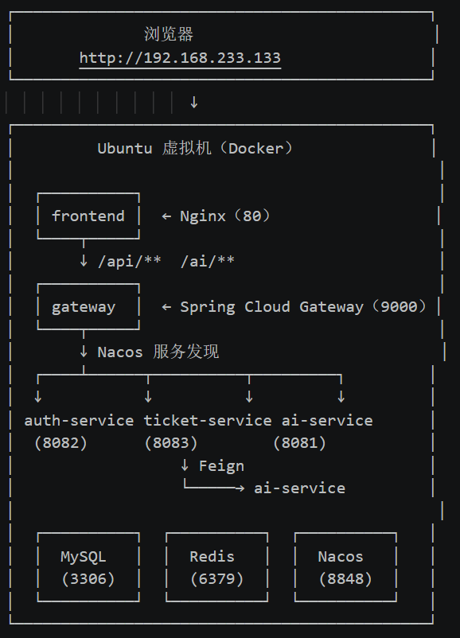
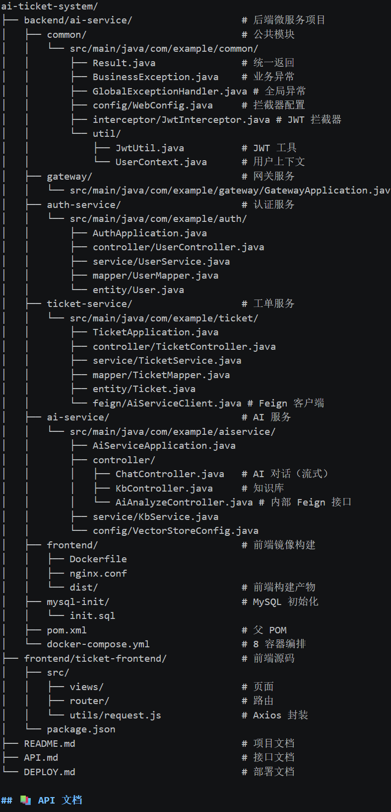

# 智能工单管理系统（AI-Powered Ticket Management System）

一个基于 Spring Cloud Alibaba 微服务架构 + Spring AI + Vue 3 的企业级智能工单管理系统。系统集成了 AI 能力，实现工单自动分类、RAG 知识库问答、SSE 流式对话等核心功能，帮助企业内部高效处理问题反馈。

## ✨ 核心功能

- 用户模块：注册、登录、JWT 认证、权限控制
- 工单模块：工单 CRUD、状态流转、权限隔离
- AI 工单分析：提交工单时，AI 自动提取摘要、分类、优先级
- AI 智能对话：支持流式输出（打字机效果）、多轮对话记忆
- RAG 知识库：上传企业文档，AI 基于文档内容精准回答
- 完整前端：Vue 3 + Element Plus 实现的可视化界面
- 微服务架构：基于 Spring Cloud Alibaba，4 个微服务 + Nacos + Gateway
- Docker 部署：8 个容器一键编排启动

## 🛠 技术栈

### 后端

- 框架：Spring Boot 3.5.0
- 微服务：Spring Cloud 2025.0.0 + Spring Cloud Alibaba 2025.0.0.0
- 服务注册：Nacos 2.4.3
- API 网关：Spring Cloud Gateway
- 服务调用：OpenFeign + LoadBalancer
- AI 框架：Spring AI 1.0.0
- 大模型：通义千问 qwen-plus（对话）+ text-embedding-v4（向量化）
- ORM：MyBatis-Plus 3.5.9
- 认证：JWT（jjwt 0.12.6）+ BCrypt 密码加密
- 数据库：MySQL 8.0 + Redis Stack（向量存储）
- JDK：Java 25

### 前端

- 框架：Vue 3 + Vite
- UI：Element Plus
- HTTP：Axios
- 路由：Vue Router 4

### 部署

- 容器：Docker + Docker Compose
- Web 服务器：Nginx（前端 + 反向代理）
- 环境：Ubuntu 虚拟机 + VMware

## 🏗 系统架构

### 微服务拆分

| 服务 | 端口 | 职责 |
|------|------|------|
| gateway | 9000 | API 网关，统一入口、路由、跨域 |
| auth-service | 8082 | 用户注册、登录、JWT 签发 |
| ticket-service | 8083 | 工单 CRUD、通过 Feign 调用 ai-service |
| ai-service | 8081 | AI 对话、RAG 知识库、工单智能分析 |
| common | - | 公共模块（Result、JWT 工具、异常处理、拦截器） |

## 🎯 项目亮点

### 1. 完整的微服务架构

基于 Spring Cloud Alibaba 生态，从单体应用演进到 4 个微服务的分布式架构：

- 使用 Nacos 作为服务注册中心，实现服务自动发现
- 使用 Spring Cloud Gateway 作为统一入口，集中处理路由和跨域
- 使用 OpenFeign 实现服务间调用（ticket-service 通过 Feign 调用 ai-service 做 AI 分析）
- 抽取 common 公共模块，统一管理 JWT 工具、全局异常、拦截器

### 2. AI 与业务深度融合

工单提交时，ticket-service 通过 Feign 远程调用 ai-service，AI 自动分析内容，提取摘要、分类、优先级。AI 分析失败时使用默认值兜底，保证工单正常创建——这是工程思维。

### 3. RAG 知识库问答

基于 Redis Stack 向量数据库 + 通义千问 Embedding 模型，实现企业文档的向量化存储与检索。用户提问时，系统先检索相关文档片段，再让 AI 基于这些片段回答，做到不瞎编、可溯源。

### 4. SSE 流式输出

使用 Spring AI 的 stream() API + WebFlux 的 Flux<String>，配合前端 fetch + ReadableStream 手动解析 SSE，实现打字机效果。

### 5. 多轮对话记忆

基于 Spring AI 的 MessageWindowChatMemory + InMemoryChatMemoryRepository，按 sessionId 隔离不同用户的对话历史，支持多轮上下文。

### 6. Docker Compose 一键编排 8 容器

Nginx、Gateway、3 个微服务、Nacos、MySQL、Redis 通过 docker-compose.yml 统一编排，支持一键启动、一键停止、一键回滚。

## 🚀 快速启动

### 前置条件

- Docker + Docker Compose
- JDK 17+、Maven 3.8+、Node.js 18+
- 通义千问 API Key（阿里云百炼 https://bailian.console.aliyun.com/ 注册获取）

### 启动步骤

1. 克隆仓库

git clone https://github.com/Bulut3900/ai-ticket-system.git
cd ai-ticket-system/backend/ai-service

2. 打包后端（4 个微服务）

cd backend/ai-service
mvn clean install -DskipTests

3. 打包前端

cd frontend/ticket-frontend
npm install
npm run build
cp -r dist ../../backend/ai-service/frontend/

4. 配置 API Key

编辑 backend/ai-service/docker-compose.yml，把 SPRING_AI_OPENAI_API_KEY 改成你的真实 Key：

environment:
  SPRING_AI_OPENAI_API_KEY: sk-your-real-key-here

5. 启动所有容器

cd backend/ai-service
docker compose up -d --build

6. 初始化数据库

MySQL 首次启动会自动执行 mysql-init/init.sql，建表并初始化 admin 用户。

7. 访问系统

- 前端：http://localhost
- Nacos 控制台：http://localhost:8848/nacos（nacos / nacos）

## 📁 项目结构

## 📚 API 文档

详细的接口文档请查看 API.md。

所有接口通过 Gateway 统一访问：http://localhost:9000

| 模块 | 路径前缀 | 说明 |
|------|---------|------|
| 用户 | /api/user/** | 注册、登录 |
| 工单 | /api/ticket/** | 工单 CRUD |
| 知识库 | /api/kb/** | 文档上传、问答 |
| AI | /ai/** | AI 对话、流式输出、工单分析 |

## 🔧 技术难点与解决方案

| 难点 | 解决方案 |
|------|----------|
| Spring AI 1.0.0 与 Spring Boot 4.x 不兼容 | 降级 Spring Boot 至 3.5.0 |
| Lombok 与 JDK 25 兼容问题 | 在 maven-compiler-plugin 配置 annotationProcessorPaths |
| 跨模块 Bean 扫描失败 | 使用 @SpringBootApplication(scanBasePackages = "com.example") |
| 服务注册失败（Client not connected） | Nacos 启动慢，加 restart: always + fail-fast: false |
| Bean 冲突（WebConfig） | 从 auth-service 删除重复文件，统一放到 common |
| 服务名冲突 | 检查每个服务的 spring.application.name |
| RedisVectorStore 自动配置不稳定 | 手动配置 Bean |
| SSE 中文乱码 | 配置 server.servlet.encoding.force=true |
| Docker 内服务互访失败 | 通过环境变量 NACOS_ADDR/MYSQL_HOST/REDIS_HOST 注入服务名 |
| Nginx 启动时 gateway DNS 解析失败 | 使用 resolver 127.0.0.11 + 变量延迟解析 |
| 前后端跨域 | 前端使用相对路径 + Nginx 反向代理 |

## 📝 后续计划

- [x] 微服务拆分（Spring Cloud Alibaba）：auth-service、ticket-service、ai-service、gateway
- [x] Nacos 服务注册与配置中心
- [ ] Sentinel 限流熔断
- [ ] RAG 支持 PDF、Word、Markdown 等多种格式
- [ ] 管理员后台（用户管理、工单分配）
- [ ] 单元测试与集成测试
- [ ] CI/CD 自动化部署

## 👨💻 作者

- GitHub: @Bulut3900

## 📄 License

MIT License